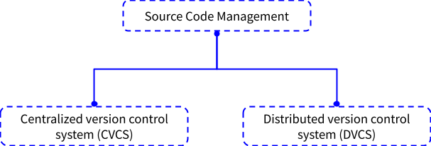
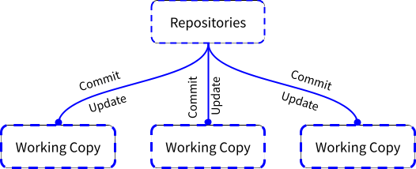

#  🐍 Introduction to DevOps
**2. Devops Stages**
<h2> Version Control</h2>

Version control is a set of practices and tools for managing codebases. Developers use version control to keep track of every line of code, and share, review, and synchronize changes among a team.

 Other version control tools like-
 
 - Mercurial
 -  Apache Subversion (SVN)
 - Concurrent Version Systems (CVS)
 - Perforce
 - Bazaar
 - Bitkeeper
 -  Fossil

<h3>How the Centralized version control system works ?</h3>

Centralized control version system only has 2 repositories a master repositories and client repositories. 
The server act as a master repositories and developers personal workspace acts as a client repositories. Everytime the user/client
need to be on the same network to access the master repositories because you can't access it remotely. User/Client commits directly to the <code> main </code> branch.
Centralized version control system basically used for small team member and large file commits.

