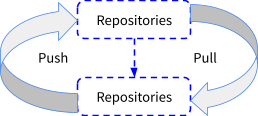

#  🐍 Introduction to DevOps

**2. Devops Stages**

<h2> Version Control</h2>

Version control is a set of practices and tools for managing codebases. Developers use version control to keep track of every line of code, and share, review, and synchronize changes among a team. We are gonna focus on Git here.

 Other version control tools like-

- Mercurial

- Apache Subversion (SVN)

- Concurrent Version Systems (CVS)

- Perforce

- Bazaar

- Bitkeeper

- Fossil

<h3>How the Centralized version control system works ?</h3>

Centralized control version system only has 2 repositories a master repositories and client repositories. 

The server act as a master repositories and developers personal workspace acts as a client repositories. Everytime the user/client

need to be on the same network to access the master repositories because you can't access it remotely. User/Client commits directly to the <code> main </code> branch.

Centralized version control system basically used for small team member and large file commits.

<h3>Advantages of CVCS</h3>

When a developer chnages to the bulid and push it to the server repositories there should be a commit message, showing who and which exact file they changed and where did actually the code changed. 

 Binary files, such as graphic assets and text files, require a large amount of space, so software developers turn to centralized version control systems to store this data. With a centralized server, teams can pull a few lines of code without saving the entire history on their local machine. Users of distributed systems have to download the entire project, which takes up time and space and prevents them from doing diffs. If a team works with binary files regularly, a centralized system offers the most efficient approach to code development.

###  Disadvantage of CVCS

All the system main files and metadata are stored in to an single repositories. If, somehow the server's main repositories crashed or get corrupted, all the system files would be lost,

Also, u can't access the data form server remotely, you will always need to be on a specific network to access it.

<h3>How the Distributed version control system works ?</h3>

 - Every workstation developer has a copy of a main repositories on their local Hard-Drive, developer can fetch data from main repositories to their local repositories, edit the contents of local repositories, commit and push it back to the central/main/remote repositories.
 - If somehow the server side repo/main repositories get crashed or corrupted,every developer has a local copy of that main repositories on their hard-drive. So, data loss should't be a issue.

Every new content u can pull form the server side repositories and after changes you can push into the server repositories.
<h2> Git and Github</h2>

Git is a distributed version control tool thats supports Distributed Non-linear workflow by providing data assurance for developing quality software.

Before using Git ,you need to have install Git in your system.
<h3>how to install Git?</h3>

Open browser and go to (https://git-scm.com/downloads) and download Git for windows,linux or Mac-os.

<h4>How Git actually works..?</h4>
Lets understand the below Diagram

 * Version control is the management of changes to document, computer programmes and large websites etc etc.
 * These changes are usally termed as "version".
 * For example Git and Apache Subversion is a Distributed version control system, where Apache CVS and Mercurial are Centralized version control system.
 * Only Git has branching that makes git a non-linear version control system.

- Version control is the management of changes to document, computer programmes and large websites etc etc.
- These changes are usally termed as "version".
- For example Git and Apache Subversion is a Distributed version control system, where Apache CVS and Mercurial are Centralized version control system.
- Only Git has branching that makes git a non-linear version control system

<h3> Git operations and Commands</h3>

just open <b>git bash</b> on any folder to start.

<code>$git init</code> that is going to create you a empty repositories in ur local hard-drive.

<code>$git add "file name"</code> that is going add your file to the staging area of the git cycle. 

<code>$ls</code> is gonna show every file available in that directory.

violet ones are folders and you can see the file name with extension.

<code>$git add .</code> that will add all files to the staging area of the cycle.

you can check your staging status by <code>$ git status</code>

<code>$git commit -m "message"</code> 
this will commit ur code with a message to push to the remote/central repositories. 
Sometimes, when you make small changes, using the staging environment seems like a waste of time. It is possible to commit changes directly, skipping the staging environment. The<code> -a</code> option will automatically stage every changed, already tracked file.

<code>$git remote add origin "repo SSH" </code>this will connect ur local repositories with your remote repositories.So, you can push and pull code from both of your repositories.

Before that, let me show you how to get your remote repositories SSH.
 
just copy your SSH from there.

<code>$git push origin master</code> this will push all your commited file to the remote repository

<code>$git pull origin master</code> that will pull everything on your remote repositories to your local repositories 

Always remember 'master' is your branch name, your git repositories can have as many as branch, thats why git is a non-linear version control system,like a tree.

<h4>Parallel Development in Git - </h4>
<b>Branch</b>

Branches are pointers to a specific commit

Branches are two types - Local branch and Remote-tracking branch.

 <code>$git branch <branch name></code> that will create you a new branch in your remote repository. 

<code>$git checkout 'branch name'</code> that will swich to that branch.

 <code>$git checkout -b 'new-branch'</code> The -b option is a convenience flag that tells Git to run git branch before running git checkout <new-branch>.
